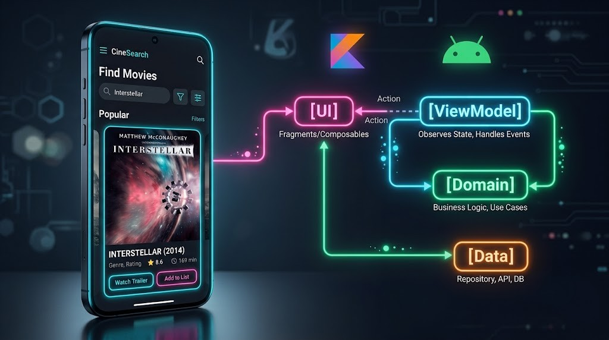

<div align="center">
  <a href="README.md">🇷🇺 <b>Русский</b></a> | <a href="README_EN.md">🇬🇧 <b>English</b></a>
</div>

<br/>

<div align="center">
  <h1>🎬 MovieSearchApp — MVVM & Clean Architecture & Live Flow Inspector</h1>
  <p>
    <b>Мой учебный проект: рефакторинг поиска фильмов с переходом на паттерн MVVM (Model-View-ViewModel) поверх Clean Architecture, а также наглядная визуализация работы слоёв прямо на экране.</b>
  </p>

  <!-- Блок бэйджей -->
  
  
  
  
  
</div>

---

## 📱 Превью проекта

<div align="center">
  
  <br/>
  <i>* Интерактивная панель в реальном времени показывает, как запрос проходит через слои UI ➔ ViewModel ➔ Domain ➔ Data</i>
</div>

---

## 💡 О проекте

Проект изначально был написан с использованием Clean Architecture (на коллбеках). В рамках нового этапа обучения я выполнил глубокий рефакторинг и внедрил современный паттерн **MVVM (Model-View-ViewModel)**. 

Теперь `Activity` (слой UI) полностью отвязан от вызова интеракторов и бизнес-логики. Вместо этого он лишь наблюдает за потоком данных (через `LiveData`), которые поставляет `ViewModel`. Кроме того, я реализовал автоматический поиск (паттерн **debounce**) при вводе текста, избавившись от лишней кнопки "Найти".

Для портфолио я также обновил встроенный **Live Flow Tracker** (Вау-эффект): теперь на главном экране вживую отображается не только путь от Domain к Data, но и участие слоя `[🧠 ViewModel]`.

---

## 🔥 Что было сделано при рефакторинге

1. **Переход на паттерн MVVM**:
   - Созданы `MoviesViewModel` и `PosterViewModel`.
   - Внедрена обёртка состояния `MoviesState` (Loading, Content, Error, Empty).
   - Слой UI (`MoviesActivity`) теперь только отрисовывает состояние, полученное через подписку на `LiveData`.
2. **Debounce-поиск (Автоматический поиск)**:
   - Кнопка «Поиск» удалена. Реализован `TextWatcher`, который с помощью задержки (debounce) отправляет запрос только если пользователь перестал печатать на 2 секунды.
3. **Обновление интерактивного HUD-инспектора**:
   - Добавлен новый слой `[🧠 ViewModel]` со своим фирменным (розовым) цветом.
   - В момент поиска индикаторы загораются по мере прохождения сигнала: `UI ➔ ViewModel ➔ Domain ➔ Data ➔ Mapping ➔ ViewModel ➔ UI`.
   - В шторке логов (`BottomSheetDialog`) теперь видно, как `ViewModel` управляет состояниями экрана и делает debounce запросов.
4. **Clean Architecture (сохранено)**:
   - Слой **Domain** всё так же написан на чистом Kotlin, не зная о платформе.
   - Слой **Data** использует Retrofit и синхронные сетевые запросы `execute()`, так как асинхронностью управляет слой Domain (через `Executor`).

---

## 🚀 Как запустить проект

1. **Клонируйте репозиторий**:
   ```bash
   git clone https://github.com/Artem-SPb/MovieSearchApp-MVVM.git
   cd MovieSearchApp-MVVM
   ```
2. **Получите бесплатный API-ключ OMDb**:
   - Зарегистрируйтесь на сайте [omdbapi.com/apikey.aspx](https://www.omdbapi.com/apikey.aspx) и получите бесплатный ключ.
3. **Добавьте ключ в `local.properties`**:
   - Откройте или создайте файл `local.properties` в корне проекта.
   - Пропишите свой ключ в формате:
     ```properties
     OMDB_API_KEY=YOUR_API_KEY
     ```
4. **Запустите проект в Android Studio**:
   - Соберите и запустите приложение на эмуляторе или реальном устройстве (Android 8.0+ / API 26+).
   - Просто вводите название фильма на английском (например: `Inception`, `Matrix`), и через 2 секунды начнётся автоматический поиск!
   - Открывайте **Лог слоёв**, чтобы изучить архитектурный поток данных под капотом.

---

## 👨‍💻 Автор

**Artem (Artem-SPb)**
- GitHub: [@Artem-SPb](https://github.com/Artem-SPb)

---

<div align="center">
  <p>⭐ Если вам понравился этот проект и реализация MVVM — буду очень рад вашей звезде на GitHub!</p>
</div>
